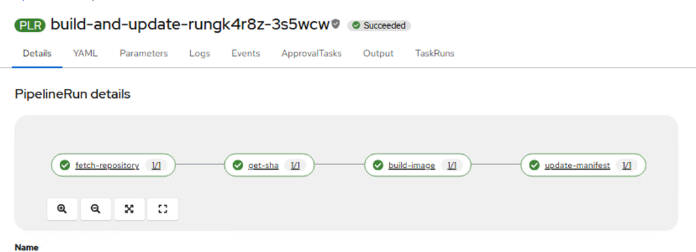

# Build and Update Pipeline

This pipeline builds a container image from source, pushes it to a registry, and updates a Kustomize deployment manifest in a corresponding configuration repository.

> **Important for OpenShift 4.20+**: You may need to enable the **Dynamic Plugin** for OpenShift Pipelines to ensure that tasks in the `openshift-pipelines` namespace (like `git-clone` and `buildah`) are visible and accessible to other namespaces via the Cluster Resolver.

## Prerequisites

Before running this pipeline, you must configure the following resources in your namespace.

### 1. Secrets

Two secrets are required for authentication:

*   **Git Authentication (`git-auth`)**: Used to clone source repositories and push updates to the config repository.
*   **Registry Authentication (`registry-auth`)**: Used to push the built container image to your container registry (e.g., Quay.io).

**Setup:**

1.  Copy the template file `secret-git.yaml` and fill in your Git credentials (username/token).
    ```bash
    oc apply -f secret-git.yaml
    ```
2.  Copy the template file `secret-registry.yaml` and fill in your Registry credentials.
    ```bash
    oc apply -f secret-registry.yaml
    ```

### 2. ServiceAccount

In OpenShift, the `pipeline` ServiceAccount is automatically created by the OpenShift Pipelines operator. **Do not create it manually.**

Instead, you must link your secrets to this existing ServiceAccount so that the pipeline can use them.

**Setup:**

Link the secrets to the `pipeline` ServiceAccount:

```bash
# Link Git credentials for cloning/pushing
oc secrets link pipeline git-auth

# Link Registry credentials for pushing images (mounts as a pull secret)
oc secrets link pipeline registry-auth --for=mount
```

### 3. PersistentVolumeClaim (PVC)

A Shared Workspace is required to pass artifacts (source code) between tasks.

**Setup:**

Create the PVC:

```bash
oc apply -f pvc.yaml
```

### 4. Custom Tasks

This pipeline uses a custom task `get-commit-sha` to extract the git SHA for tagging. Ensure this task is applied:

```bash
oc apply -f get-commit-sha-task.yaml
```

> **Note:** The `git-clone` and `buildah` tasks are resolved from the `openshift-pipelines` namespace via the Cluster Resolver.

## Running the Pipeline

Once the prerequisites are set up, you can run the pipeline using the provided `pipelinerun.yaml`.

1.  Edit `pipelinerun.yaml` to set your specific parameters:
    *   `git-url`: Your source code repository.
    *   `image-name`: The target image repository (do not include a tag).
    *   `deployment-repo-url`: Your configuration/manifest repository.
    *   `deployment-file-path`: Path to the `kustomization.yaml` file (e.g., `overlays/dev/kustomization.yaml`).

2.  Start the pipeline:

    ```bash
    oc create -f pipelinerun.yaml
    ```

## Success Result


